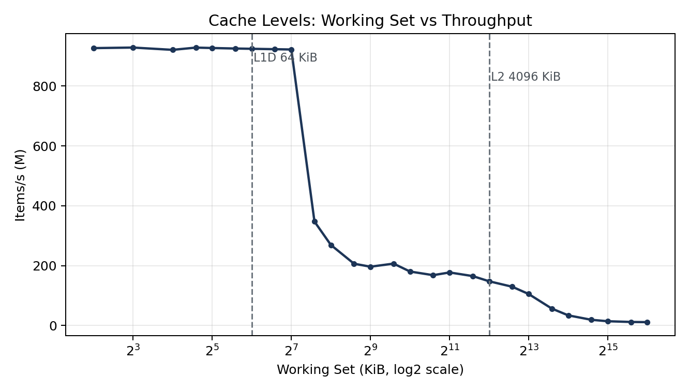
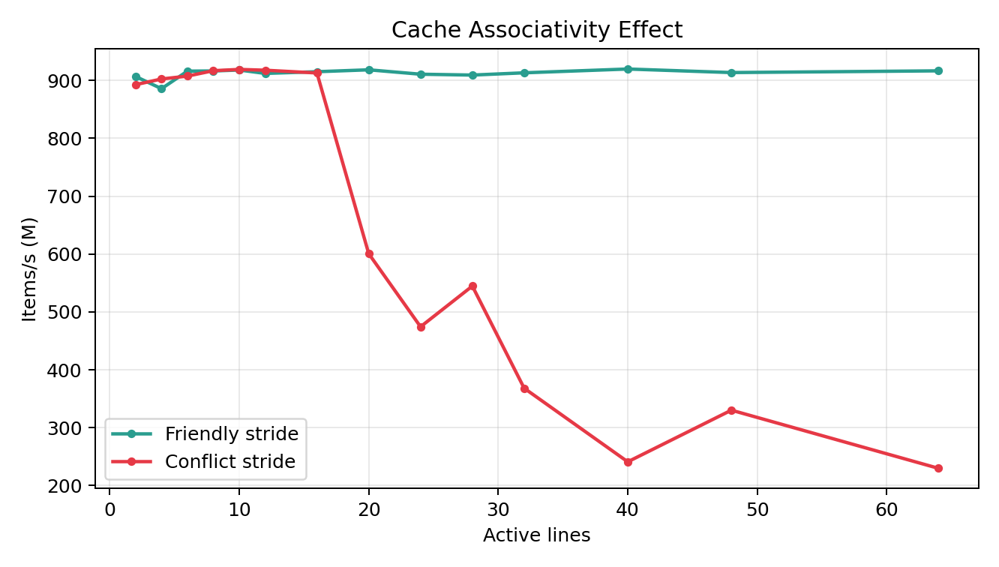
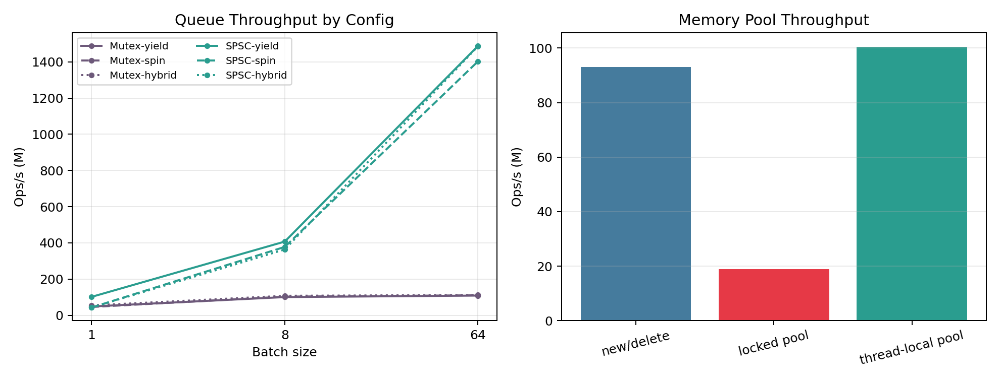

# cpp-performance-lab

A C++ microbenchmark repository for cache behavior, memory access, synchronization, communication paths, language/runtime overhead, allocator tradeoffs, container lookup, and syscall or network boundary cost.

## Purpose

- Build intuition for cache hierarchy and memory access patterns
- Compare concurrency, communication, language, container, and allocator tradeoffs with reproducible microbenchmarks
- Measure syscall, IPC, and local transport overhead with small focused benchmarks
- Produce evidence-based performance notes from stable runs

## 1) Prerequisites

- CMake >= 3.20
- A C++20 compiler (clang++ or g++)
- Git + internet access (for fetching `google/benchmark`)

## 2) Build

```bash
cmake -S . -B build -DCMAKE_BUILD_TYPE=Release
cmake --build build -j
```

## 3) Run all benchmarks (recommended)

```bash
scripts/run_all.sh
```

## 4) Run a specific benchmark

Standard pattern:

```bash
./build/benchmark/<binary_name> --benchmark_min_time=0.3s
```

Examples:

```bash
./build/benchmark/bm_stride_access --benchmark_min_time=0.3s
./build/benchmark/bm_cache_levels --benchmark_min_time=0.3s
```

Queue tuned run:

```bash
./build/benchmark/bm_queue \
  --benchmark_filter='BM_Queue(MutexTransfer/batch:64/backoff:0|SpscRingTransfer/batch:8/backoff:0)$' \
  --benchmark_min_time=1s \
  --benchmark_repetitions=10 \
  --benchmark_report_aggregates_only=true
```

## 5) Benchmarks

- `bm_stride_access`: locality loss from larger access stride
- `bm_pointer_chasing`: sequential access vs irregular pointer traversal
- `bm_false_sharing`: adjacent counters vs cache-line-padded counters
- `bm_aos_vs_soa`: layout sensitivity for dense vs sparse field usage
- `bm_mutex_vs_atomic`: contention scaling for shared counter updates
- `bm_cache_levels`: throughput drop as working set crosses cache levels
- `bm_ilp`: dependent vs independent instruction streams
- `bm_branch_prediction`: predictable, alternating, random, and branchless control flow
- `bm_inlining_effects`: forced inline, forced noinline, and function-pointer call shape
- `bm_cache_associativity`: friendly stride vs conflict-prone stride
- `bm_queue`: mutex queue vs tuned SPSC ring transfer
- `bm_mpsc_mpmc_queue`: mutex queue vs bounded lock-free queue under MPSC and MPMC load
- `bm_cv_vs_spin`: condition variable, yield, and spinning handoff cost
- `bm_lock_variants`: mutex, spinlock, and ticket-lock contention scaling
- `bm_queue_message_size`: queue throughput across multiple payload sizes
- `bm_memory_pool`: `new/delete` vs locked pool vs thread-local pool
- `bm_tlb_pressure`: contiguous, page-stride, and randomized page walks
- `bm_cross_thread_free`: producer allocation with consumer-side free across general-purpose, pool, and PMR paths
- `bm_allocator_variants`: `new/delete`, `malloc/free`, `pmr`, and arena-style allocation
- `bm_allocator_mixed_size`: mixed-size allocation across general-purpose and PMR pool paths
- `bm_vector_deque_list`: sequence-container scan cost across `vector`, `deque`, and `list`
- `bm_mmap_vs_read`: sequential `read`, random `pread`, and mapped-file scan
- `bm_clock_overhead`: `chrono`, `clock_gettime`, and `gettimeofday` call cost
- `bm_mmap_cow`: private first-touch/rewrite and shared mapped-write behavior
- `bm_page_fault_mlock`: first-touch, prefaulted, and `mlock`-backed page access
- `bm_memory_order`: throughput and correctness litmus tests across `relaxed`, release/acquire, and `seq_cst`
- `bm_thread_affinity`: default vs shared/split placement-hint thread handoff with verification counters
- `bm_pipe_vs_shm`: pipe syscall handoff vs shared-memory mailbox handoff
- `bm_socketpair_vs_pipe`: Unix stream `socketpair` vs pipe message handoff
- `bm_virtual_vs_template_dispatch`: template, virtual, and function-pointer dispatch
- `bm_std_function_vs_lambda`: lambda, functor, function pointer, and `std::function`
- `bm_exception_vs_error_code`: exception path vs optional-style error signaling
- `bm_variant_vs_virtual`: `std::variant` visitation vs virtual hierarchy dispatch
- `bm_dynamic_cast_vs_tag`: RTTI-based dispatch vs enum-tag dispatch
- `bm_aliasing_effects`: potential aliasing vs `restrict`-style no-alias access
- `bm_container_lookup`: `map`, `unordered_map`, and sorted-vector lookup
- `bm_socket_loopback`: local TCP vs Unix stream loopback message transfer

## 6) Outputs

- `results-summary.md`: current run summary and conclusions

Generate figures from benchmark runs:

```bash
python3 scripts/generate_plots.py
```

## 7) Figures

### Cache Levels



### Cache Associativity



### Queue and Memory Pool



## 8) Source Layout

- `benchmark/cache/`: cache, locality, and working-set behavior
- `benchmark/layout/`: data layout experiments
- `benchmark/concurrency/`: synchronization, queues, and thread placement
- `benchmark/memory/`: allocator and pooling behavior
- `benchmark/cpu/`: instruction-throughput experiments
- `benchmark/containers/`: container and lookup tradeoff benchmarks
- `benchmark/language/`: dispatch and callable abstraction benchmarks
- `benchmark/syscalls/`: file and syscall boundary measurements
- `benchmark/ipc/`: communication-path benchmarks
- `benchmark/network/`: local socket and transport-path benchmarks
