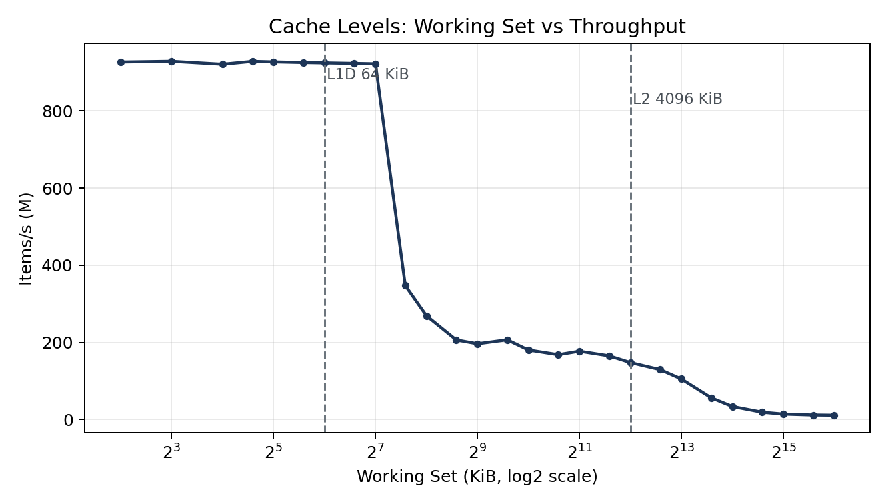
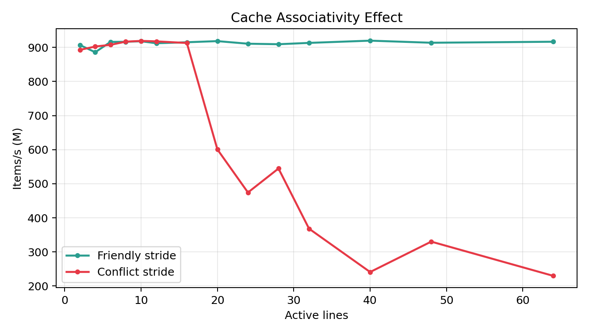
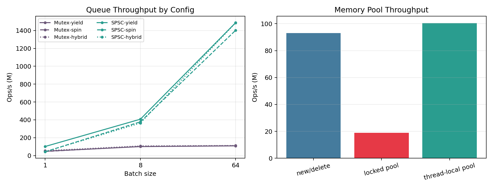

# cpp-performance-lab

A C++ microbenchmark repository for cache behavior, memory access, synchronization, communication paths, language/runtime overhead, allocator tradeoffs, container lookup, and syscall or network boundary cost.

## Start Here

- [Results summary](results-summary.md): primary document for benchmark findings, plots, code links, and conclusions
- `README.md`: build, run, and repository navigation

## Purpose

- Build intuition for cache hierarchy and memory access patterns
- Compare concurrency, communication, language, container, and allocator tradeoffs with reproducible microbenchmarks
- Measure syscall, IPC, and local transport overhead with small focused benchmarks
- Produce evidence-based performance notes from stable runs

## 1) Prerequisites

- CMake >= 3.20
- A C++20 compiler (clang++ or g++)
- Git + internet access (for fetching `google/benchmark`)

## 2) Build

```bash
cmake -S . -B build -DCMAKE_BUILD_TYPE=Release
cmake --build build -j
```

## 3) Run all benchmarks (recommended)

```bash
scripts/run_all.sh
```

## 4) Run a specific benchmark

Standard pattern:

```bash
./build/benchmark/<binary_name> --benchmark_min_time=0.3s
```

Examples:

```bash
./build/benchmark/bm_stride_access --benchmark_min_time=0.3s
./build/benchmark/bm_cache_levels --benchmark_min_time=0.3s
```

Queue tuned run:

```bash
./build/benchmark/bm_queue \
  --benchmark_filter='BM_Queue(MutexTransfer/batch:64/backoff:0|SpscRingTransfer/batch:8/backoff:0)$' \
  --benchmark_min_time=1s \
  --benchmark_repetitions=10 \
  --benchmark_report_aggregates_only=true
```

## 5) Results

- [Results summary](results-summary.md): grouped benchmark findings, plots, jump index, and direct source links

Generate figures from benchmark runs:

```bash
python3 scripts/generate_plots.py
```

Generate mechanism diagrams used by the summary:

```bash
python3 scripts/generate_mechanism_diagrams.py
```

## 6) Benchmark Areas

- `benchmark/cache/`: cache, locality, and working-set behavior
- `benchmark/layout/`: data layout experiments
- `benchmark/concurrency/`: synchronization, queues, and thread placement
- `benchmark/memory/`: allocator and pooling behavior
- `benchmark/cpu/`: instruction-throughput experiments
- `benchmark/containers/`: container and lookup tradeoff benchmarks
- `benchmark/language/`: dispatch and callable abstraction benchmarks
- `benchmark/object_model/`: return-value optimization and object model behavior
- `benchmark/syscalls/`: file and syscall boundary measurements
- `benchmark/ipc/`: communication-path benchmarks
- `benchmark/network/`: local socket and transport-path benchmarks

## 7) Figures

### Cache Levels



### Cache Associativity



### Queue and Memory Pool


