# Results Summary

## Environment

- Date: 2026-03-21
- Additional benchmark runs: 2026-03-26
- Additional benchmark runs: 2026-05-08
- Machine / CPU: Apple Silicon (8 cores reported by benchmark)
- OS: macOS (Darwin 25.x)
- Compiler: AppleClang (C++20)
- Build flags: Release, `-O3 -march=native`
- Command: `scripts/run_all.sh` plus targeted runs for new benchmarks

## Index

| Section | Jump Targets |
| --- | --- |
| Overview | [Environment](#environment) · [Final Takeaways](#final-takeaways) |
| `benchmark/cache/` | [Stride Access](#cache-stride-access) · [Pointer Chasing](#cache-pointer-chasing) · [Cache Levels](#cache-levels) · [Cache Associativity](#cache-associativity) |
| `benchmark/layout/` | [AoS vs SoA](#layout-aos-vs-soa) |
| `benchmark/concurrency/` | [False Sharing](#concurrency-false-sharing) · [Mutex vs Atomic](#concurrency-mutex-vs-atomic) · [Queue](#concurrency-queue) · [Memory Order](#concurrency-memory-order) · [Thread Placement](#concurrency-thread-placement) · [MPSC and MPMC Queue Scaling](#concurrency-mpsc-mpmc) · [Blocking vs Spinning](#concurrency-blocking-vs-spinning) · [Lock Variants](#concurrency-lock-variants) · [Queue Message Size](#concurrency-queue-message-size) |
| `benchmark/memory/` | [Memory Pool](#memory-pool) · [TLB Pressure](#memory-tlb-pressure) · [Cross-Thread Free](#memory-cross-thread-free) · [Allocator Variants](#memory-allocator-variants) · [Mixed-Size Allocator Variants](#memory-mixed-size-allocator-variants) |
| `benchmark/cpu/` | [ILP](#cpu-ilp) · [Branch Predictability](#cpu-branch-predictability) · [Inlining Effects](#cpu-inlining-effects) · [Aliasing Effects](#cpu-aliasing-effects) |
| `benchmark/containers/` | [Container Lookup](#containers-container-lookup) · [`vector` vs `deque` vs `list`](#containers-vector-deque-list) |
| `benchmark/language/` | [Dispatch Cost](#language-dispatch-cost) · [Callable Abstraction](#language-callable-abstraction) · [Exception vs Error Code](#language-exception-vs-error-code) · [`variant` vs Virtual Hierarchy](#language-variant-vs-virtual-hierarchy) · [`dynamic_cast` vs Tag Dispatch](#language-dynamic-cast-vs-tag-dispatch) |
| `benchmark/object_model/` | [NRVO and Return-Value Optimization](#object-model-nrvo-and-return-value-optimization) · [`vptr` / `vtbl` Object Model](#object-model-vptr-vtbl-object-model) · [Virtual Base Class ABI and Access Cost](#object-model-virtual-base-class-abi-and-access-cost) |
| `benchmark/syscalls/` | [`mmap` vs `read` / `pread`](#syscalls-mmap-vs-read-pread) · [Clock Call Overhead](#syscalls-clock-call-overhead) · [`mmap` Private vs Shared Writes](#syscalls-mmap-private-vs-shared-writes) · [Page Fault and `mlock`](#syscalls-page-fault-and-mlock) |
| `benchmark/ipc/` | [Pipe vs Shared-Memory Handoff](#ipc-pipe-vs-shared-memory-handoff) · [Pipe vs `socketpair`](#ipc-pipe-vs-socketpair) |
| `benchmark/network/` | [TCP Loopback](#network-tcp-loopback) |

## Benchmarks by Folder

## `benchmark/cache/`

### [Stride Access](benchmark/cache/bm_stride_access.cpp)

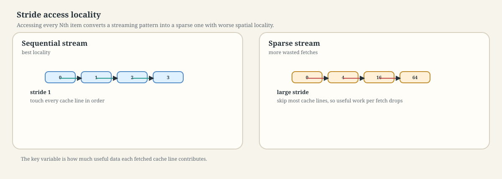

- Diagram note: stride changes how much useful data each fetched cache line contributes.

- Key numbers: stride 1/4/16/64 -> `3.49G / 3.33G / 1.01G / 0.346G items/s`
- Observation: throughput drops significantly as stride increases.
- Conclusion: reduced spatial locality makes memory access more latency-bound.
- Key takeaway: sequential access is cache-efficient; large strides cause major throughput loss.

### [Pointer Chasing](benchmark/cache/bm_pointer_chasing.cpp)

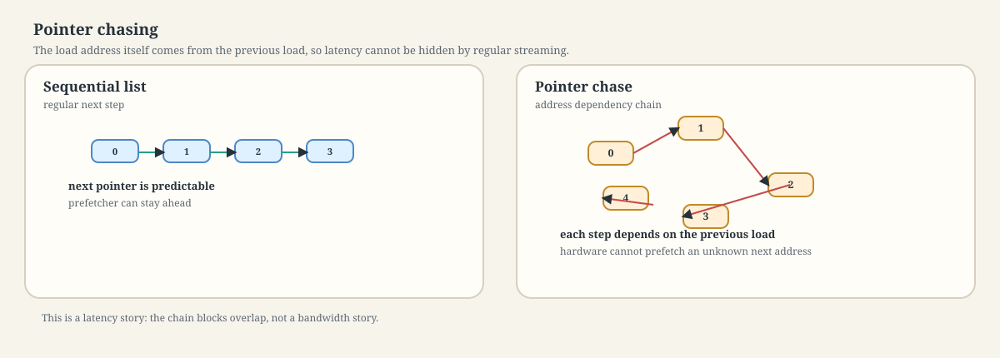

- Diagram note: pointer chasing serializes the next address, so latency cannot be hidden by regular prefetching.

- Key numbers: sequential `16.7G items/s` vs pointer chasing `12.8M items/s`
- Observation: random pointer chasing is roughly three orders of magnitude slower.
- Conclusion: hardware prefetching is ineffective and latency dominates.
- Key takeaway: irregular access patterns can overwhelm any compute-side optimization.

### [Cache Levels](benchmark/cache/bm_cache_levels.cpp)

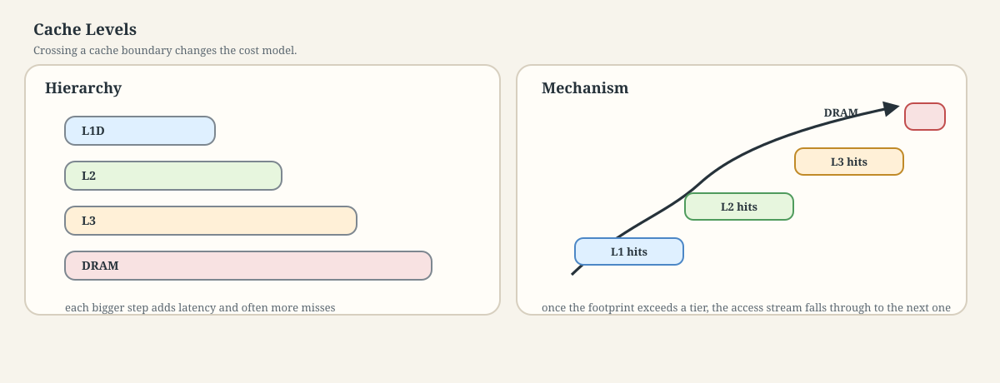

- Diagram note: once the working set crosses a cache tier, the next access path is forced to pay a higher miss cost.

- Key numbers: 4KB `1.01G` -> 256KB `280M` -> 1MB `206M` -> 16MB `88M` -> 64MB `12.7M items/s`
- Observation: clear multi-stage drops as working set increases.
- Conclusion: miss cost progressively dominates when crossing cache hierarchy boundaries.
- Key takeaway: working-set size is a primary performance control variable.

### [Cache Associativity](benchmark/cache/bm_cache_associativity.cpp)

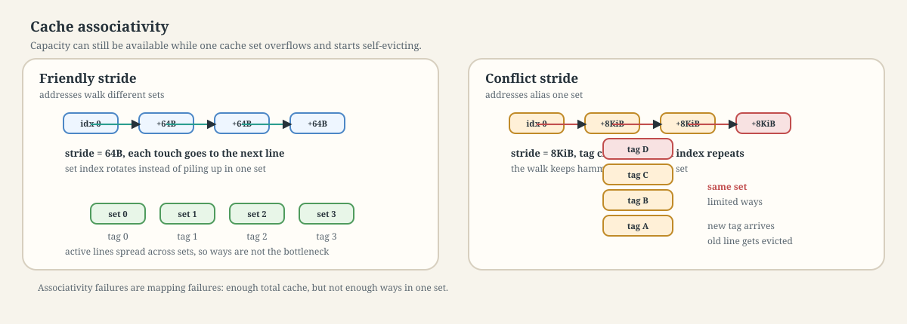

- Diagram note: enough capacity does not help if too many active lines map to the same set.

- Key numbers:
  - Friendly lines=64: `928M items/s`
  - Conflict lines=64: `254M items/s`
  - Sharp drop appears at conflict lines=32/64
- Observation: conflict-stride access collapses throughput beyond a threshold.
- Conclusion: this is conflict-miss behavior (associativity overflow).
- Key takeaway: sufficient cache capacity does not prevent set-mapping conflict penalties.

## `benchmark/layout/`

### [AoS vs SoA](benchmark/layout/bm_aos_vs_soa.cpp)

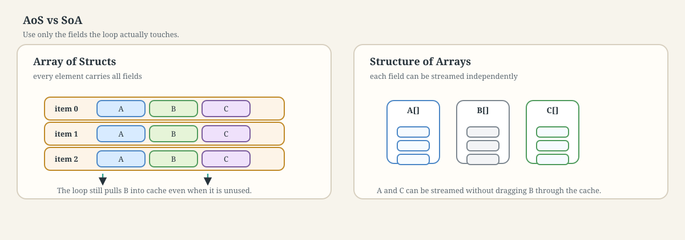

- Diagram note: AoS keeps unused fields in the same cache line as the hot fields, while SoA lets the loop stream only the fields it touches.

- Key numbers:
  - Base case: AoS `1.318G` vs SoA `1.303G items/s` (close)
  - Wide-struct, two fields used: AoS `0.983G` vs SoA `1.396G items/s`
- Observation: SoA advantage becomes clear when only a subset of fields is used.
- Conclusion: SoA improves effective bandwidth when field utilization is sparse.
- Key takeaway: layout choice should follow access density, not a fixed rule.

## `benchmark/concurrency/`

### [False Sharing](benchmark/concurrency/bm_false_sharing.cpp)

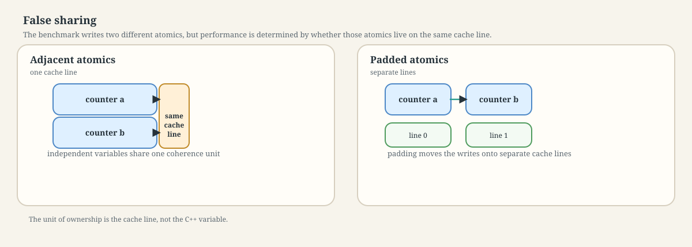

- Diagram note: false sharing is a cache-line ownership problem, not a variable-name problem.

- Key numbers: adjacent `155.7M` vs padded `509.4M items/s`
- Observation: `alignas(64)` increases throughput by about 3.3x.
- Conclusion: independent logical writes on the same cache line cause heavy coherence traffic.
- Key takeaway: cache-line ownership, not variable ownership, controls write scalability.

### [Mutex vs Atomic](benchmark/concurrency/bm_mutex_vs_atomic.cpp)

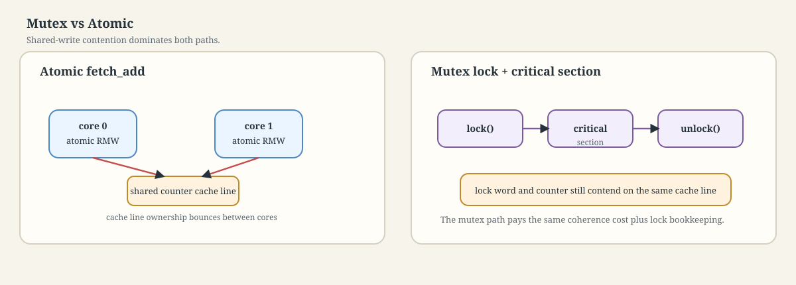

- Diagram note: both paths bounce the shared counter line, but the mutex path also pays lock management and wakeup overhead.

- Key numbers:
  - Atomic 1/2/4 threads: `571.9M / 163.3M / 44.9M`
  - Mutex 1/2/4 threads: `221.0M / 62.7M / 6.67M items/s`
- Observation: both degrade under contention; mutex degrades faster.
- Conclusion: both pay coherence costs, and mutex adds lock/unlock overhead.
- Key takeaway: contention on shared-write state dominates synchronization choice.

### [Queue](benchmark/concurrency/bm_queue.cpp)

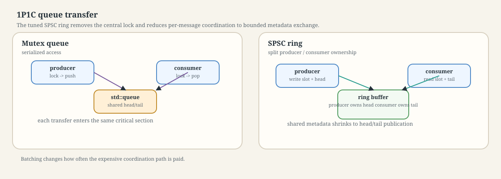

- Diagram note: the SPSC ring reduces coordination to split ownership of head and tail metadata, unlike the mutex queue.

- Key numbers (aggregate mean):
  - Mutex (`batch=64, backoff=0`): `111.6M ops/s`
  - SPSC (`batch=8, backoff=0`): `174.1M ops/s`
- Observation: with tuned parameters, SPSC outperforms mutex queue.
- Conclusion: in 1P1C transfer, ring buffers can reduce lock contention and critical-section cost.
- Key takeaway: queue performance is highly sensitive to backoff and batching policy.

### [Memory Order](benchmark/concurrency/bm_memory_order.cpp)

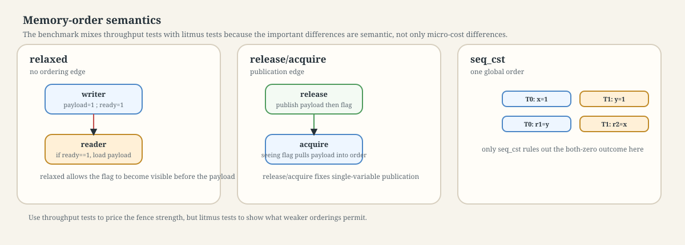

- Diagram note: throughput tests price the fence cost, but litmus tests show the actual behaviors weaker orderings permit.

- Key numbers:
  - latest rerun:
    `fetch_add` 1 thread: relaxed `527.5M`, acq_rel `527.5M`, seq_cst `528.1M items/s`
    `fetch_add` 4 threads: relaxed `25.9M`, acq_rel `38.9M`, seq_cst `24.0M items/s`
  - flag handoff: acq_rel `25.9M` vs seq_cst `26.4M handoffs/s`
  - publish/consume: release-acquire `13.3M` vs seq_cst `13.3M publishes/s`
  - SPSC ring metadata: acq_rel `30.9M` vs seq_cst `23.9M ring ops/s`
  - message passing litmus:
    relaxed bad reads mean `1.4 / 100k`
    release-acquire bad reads mean `0 / 100k`
  - store-buffering litmus:
    relaxed both-zero mean `96.9k / 100k`
    release-acquire both-zero mean `96.7k / 100k`
    seq_cst both-zero mean `0 / 100k`
- Observation: the 4-thread `fetch_add` case is dominated by cache-line contention, so `relaxed` vs acq_rel is noisy there, but the correctness litmus tests show the semantic differences cleanly.
- Conclusion: `relaxed` is not safe for publication patterns, release/acquire fixes single-variable message passing, and release/acquire is still weaker than `seq_cst` when you need a single global order across multiple atomics.
- Key takeaway: use throughput tests to measure cost, but use litmus tests to show what can actually go wrong with weaker memory orders.

### [Thread Placement](benchmark/concurrency/bm_thread_affinity.cpp)

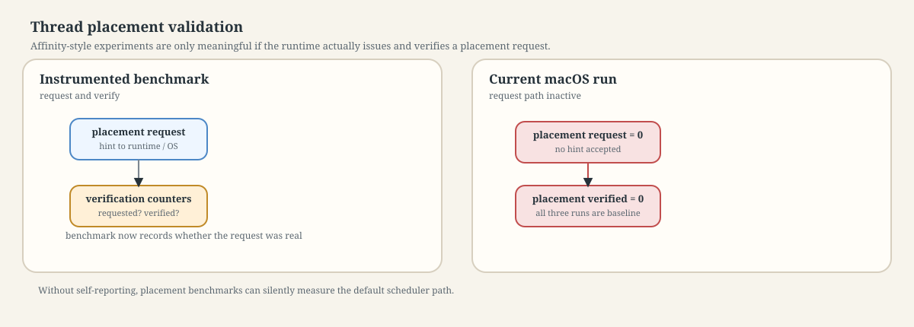

- Diagram note: a placement benchmark must record whether the OS actually accepted the request.

- Key numbers:
  - default transfer: `29.9M ops/s`
  - shared-placement hint: `30.7M ops/s`
  - split-placement hint: `30.6M ops/s`
  - placement requests: `0`
  - placement verified: `0`
- Observation: the tightened benchmark now reports whether a placement request was actually issued and verified; on this macOS run, neither happened.
- Conclusion: this machine/runtime combination is not honoring the placement path used by the benchmark, so the three variants should be interpreted as the same baseline.
- Key takeaway: placement experiments must self-report whether the OS accepted the requested policy, otherwise the benchmark can look valid while measuring nothing.

### [MPSC and MPMC Queue Scaling](benchmark/concurrency/bm_mpsc_mpmc_queue.cpp)

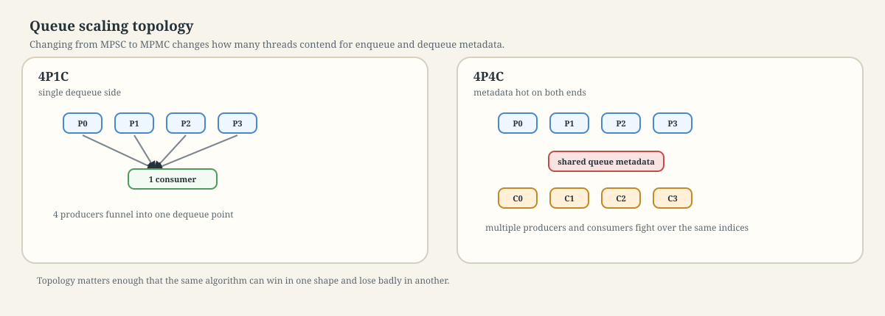

- Diagram note: the queue topology changes which end of the structure is hot, and how many threads fight there.

- Key numbers:
  - MPSC mutex queue: `8.10M msgs/s`
  - MPSC bounded MPMC queue: `9.55M msgs/s`
  - MPMC mutex queue: `21.2M msgs/s`
  - MPMC bounded MPMC queue: `7.46M msgs/s`
- Observation: the bounded lock-free queue is modestly faster in the 4P1C case, but the mutex queue is much faster in the 4P4C run on this machine.
- Conclusion: queue algorithm choice remains workload- and implementation-sensitive; lock-free does not imply universally higher throughput.
- Key takeaway: match queue design to the actual producer-consumer topology instead of assuming one structure wins everywhere.

### [Blocking vs Spinning](benchmark/concurrency/bm_cv_vs_spin.cpp)

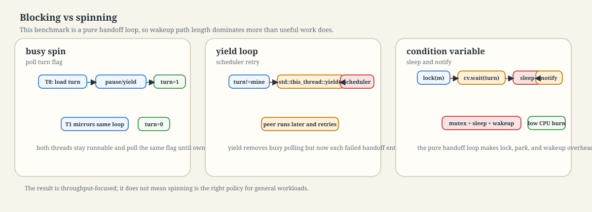

- Diagram note: spinning stays in userspace, while blocking pays scheduler and wakeup overhead.

- Key numbers:
  - spin handoff: `17.5M handoffs/s`
  - yield handoff: `253.8k handoffs/s`
  - condition variable handoff: `107.2k handoffs/s`
- Observation: busy spinning is orders of magnitude faster than yielding or blocking in this tight ping-pong benchmark.
- Conclusion: when both sides stay active and handoffs are frequent, scheduler-mediated wakeups dominate the cost.
- Key takeaway: blocking primitives save CPU, but for extremely hot handoff loops they can impose a large throughput penalty.

### [Lock Variants](benchmark/concurrency/bm_lock_variants.cpp)

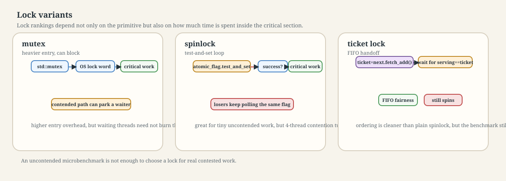

- Diagram note: lock ranking depends on how much work sits inside the critical section.

- Key numbers:
  - work=1, 1 thread: mutex `205M`, spinlock `575M`, ticket lock `528M items/s`
  - work=1, 4 threads: mutex `26.7M`, spinlock `3.18M`, ticket lock `4.33M items/s`
  - work=32, 1 thread: mutex `37.7M`, spinlock `39.6M`, ticket lock `39.7M items/s`
  - work=32, 4 threads: mutex `4.77M`, spinlock `2.48M`, ticket lock `2.69M items/s`
- Observation: once the critical section becomes larger, the uncontended advantage of spin and ticket locks mostly disappears, while their contended behavior remains poor on this machine.
- Conclusion: critical-section size matters as much as lock algorithm choice.
- Key takeaway: benchmark lock variants under both tiny and non-trivial work inside the lock; uncontended lock speed alone is not enough.

### [Queue Message Size](benchmark/concurrency/bm_queue_message_size.cpp)

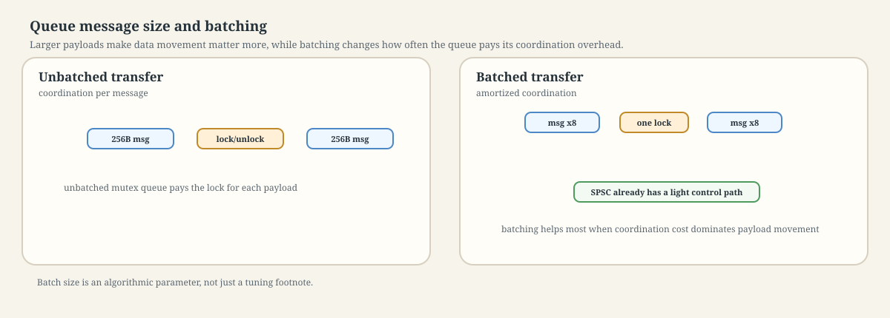

- Diagram note: batching changes how often the queue pays lock or metadata overhead relative to payload copying.

- Key numbers:
  - 256-byte payload, unbatched:
    mutex `23.2M msgs/s`, `5.93 GiB/s`
    SPSC `34.5M msgs/s`, `8.83 GiB/s`
  - 256-byte payload, batched-by-8:
    mutex `40.3M msgs/s`, `10.3 GiB/s`
    SPSC `36.5M msgs/s`, `9.35 GiB/s`
- Observation: real batching materially improves the mutex queue in this workload, while the SPSC ring changes only modestly.
- Conclusion: batching can compensate for lock overhead much more than it helps an already lightweight queue path.
- Key takeaway: queue benchmarks should test batching as an explicit algorithmic parameter, not just payload size.

## `benchmark/memory/`

### [Memory Pool](benchmark/memory/bm_memory_pool.cpp)

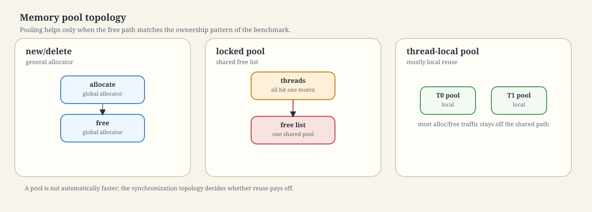

- Diagram note: pool speed depends on whether reuse stays local or needs shared synchronization.

- Key numbers:
  - `new/delete`: `109.3M ops/s`
  - locked pool: `21.3M ops/s`
  - thread-local pool: `103.1M ops/s`
- Observation: shared locked pool is the slowest; thread-local pool is close to allocator baseline.
- Conclusion: pooling can underperform when global synchronization cost is high.
- Key takeaway: allocator strategy should prioritize thread locality first.

### [TLB Pressure](benchmark/memory/bm_tlb_pressure.cpp)

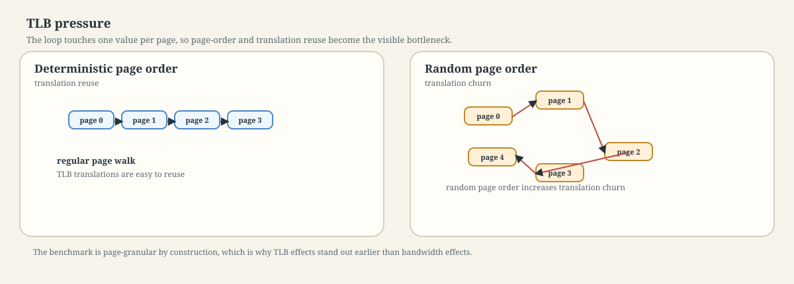

- Diagram note: one value per page makes translation behavior visible before bandwidth saturates.

- Key numbers:
  - contiguous page walk: `121.5M items/s`
  - page-stride walk: `873.8M items/s`
  - random page walk: `671.2M items/s`
- Observation: randomized page traversal is materially slower than deterministic page-stride access.
- Conclusion: once a benchmark is dominated by page-level access, TLB and page-walk behavior become visible even when every access touches only one value per page.
- Key takeaway: page access order matters; page-locality loss can reduce throughput well before bandwidth is saturated.

### [Cross-Thread Free](benchmark/memory/bm_cross_thread_free.cpp)

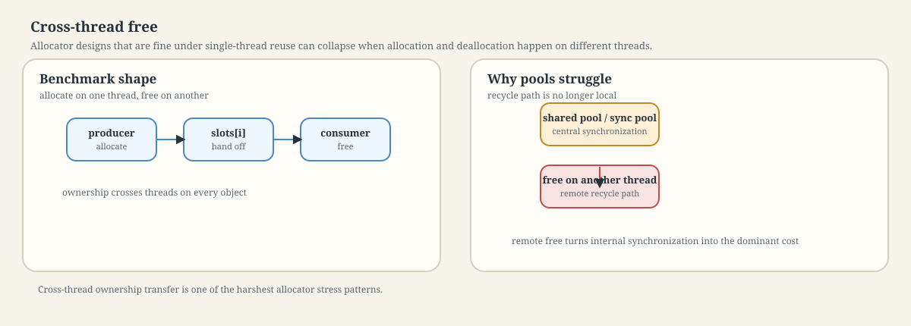

- Diagram note: allocation and free on different threads turn pool synchronization into the main cost.

- Key numbers:
  - refined rerun:
    `new/delete` `20.8M ops/s`
    `malloc/free` `25.6M ops/s`
    locked pool `7.01M ops/s`
    `pmr::synchronized_pool_resource` `882.8k ops/s`
- Observation: general-purpose allocation remains much faster than the synchronized pool-style paths once allocation and free happen on different threads, and the PMR synchronized pool is by far the slowest in this benchmark.
- Conclusion: cross-thread ownership transfer is one of the harshest allocator stress patterns because it turns internal synchronization into the dominant cost.
- Key takeaway: allocator strategies that look good in single-owner benchmarks can collapse completely once producer and consumer ownership split across threads.

### [Allocator Variants](benchmark/memory/bm_allocator_variants.cpp)

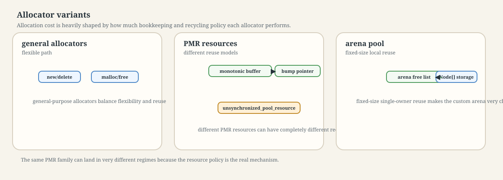

- Diagram note: allocator policy and recycling model determine whether the hot path is a bump pointer, a free list, or a general allocator.

- Key numbers:
  - refined rerun with additional PMR pool path:
    `new/delete` `33.3M ops/s`
    `malloc/free` `44.3M ops/s`
    `pmr::monotonic_buffer_resource` `133.8M ops/s`
    `pmr::unsynchronized_pool_resource` `14.7k ops/s`
    arena pool `391.8M ops/s`
- Observation: in this fixed-size single-owner benchmark, the simple arena pool is the clear winner, while the unsynchronized PMR pool resource performs extremely poorly in the current setup.
- Conclusion: allocator abstractions with different recycling policies can land in completely different performance regimes even within the same PMR family.
- Key takeaway: allocator benchmarking has to be specific about object size, recycling policy, and lifetime shape; “PMR” is not one performance point.

### [Mixed-Size Allocator Variants](benchmark/memory/bm_allocator_mixed_size.cpp)

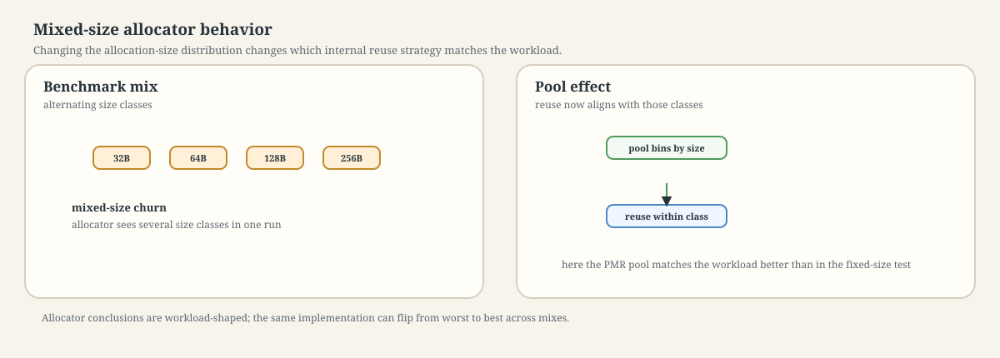

- Diagram note: changing the size mix can flip which allocator policy lines up with the workload.

- Key numbers:
  - mixed-size `new/delete`: `36.2M ops/s`
  - mixed-size `malloc/free`: `47.7M ops/s`
  - mixed-size `pmr::unsynchronized_pool_resource`: `133.5M ops/s`
- Observation: the PMR unsynchronized pool is strong in this mixed-size benchmark, which is the opposite of its behavior in the fixed-size allocator benchmark above.
- Conclusion: allocator performance can flip completely when the size distribution and recycling pattern change.
- Key takeaway: allocator selection has to be benchmarked against the actual allocation mix, not just a single synthetic size class.

## `benchmark/cpu/`

### [ILP](benchmark/cpu/bm_ilp.cpp)

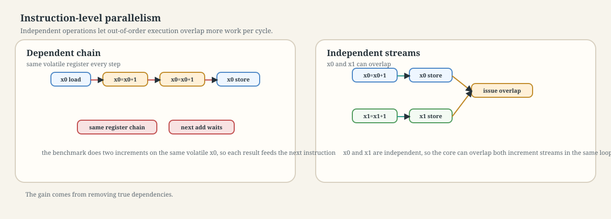

- Diagram note: dependency chains block overlap, while independent streams let the core issue more work in parallel.

- Key numbers: dependent `670M` vs independent `2.30G items/s`
- Observation: independent streams provide about 3.4x higher throughput.
- Conclusion: dependency chains limit out-of-order overlap and instruction-level parallelism.
- Key takeaway: reducing dependencies can deliver larger gains than micro-tuning instructions.

### [Branch Predictability](benchmark/cpu/bm_branch_prediction.cpp)

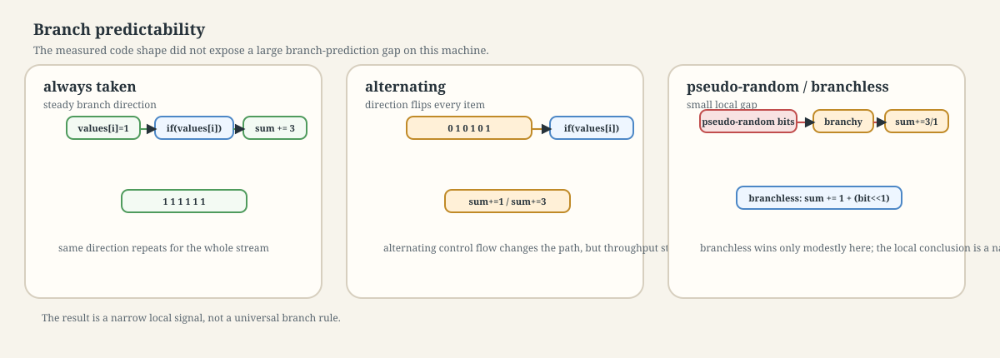

- Diagram note: this benchmark did not show a strong branch-predictor cliff on the local platform, so the picture is a narrow band rather than a dramatic swing.

- Key numbers:
- always-taken branch: `7.49G items/s`
- alternating branch: `7.55G items/s`
- pseudo-random branch: `7.56G items/s`
- branchless pseudo-random: `7.88G items/s`
- Observation: all four variants are close on this Apple Silicon and AppleClang `-O3` run, with branchless only modestly ahead.
- Conclusion: this code shape does not expose a large branch-prediction penalty on the local platform, so the valid result here is a narrow spread rather than a dramatic textbook gap.
- Key takeaway: if the branch and branchless forms converge, the right conclusion is "no strong signal here", not "branch prediction never matters".

### [Inlining Effects](benchmark/cpu/bm_inlining_effects.cpp)

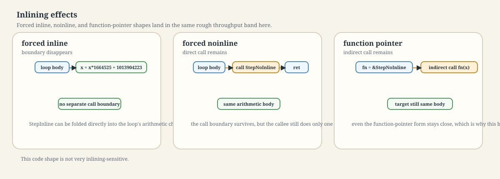

- Diagram note: in this benchmark the call shapes stay close, so the main result is that inlining was not the dominant cost lever.

- Key numbers:
- forced inline: `1.22G items/s`
- forced noinline: `1.23G items/s`
- function pointer: `1.24G items/s`
- Observation: the three call shapes land essentially on top of each other in this tight arithmetic chain benchmark.
- Conclusion: with this compiler and this code shape, forced inline vs noinline does not produce a meaningful standalone throughput difference; the stronger dispatch benchmarks remain the more useful signal.
- Key takeaway: when inlining results stay close, the repo still keeps the benchmark as a local conclusion rather than deleting the topic entirely.

### [Aliasing Effects](benchmark/cpu/bm_aliasing_effects.cpp)

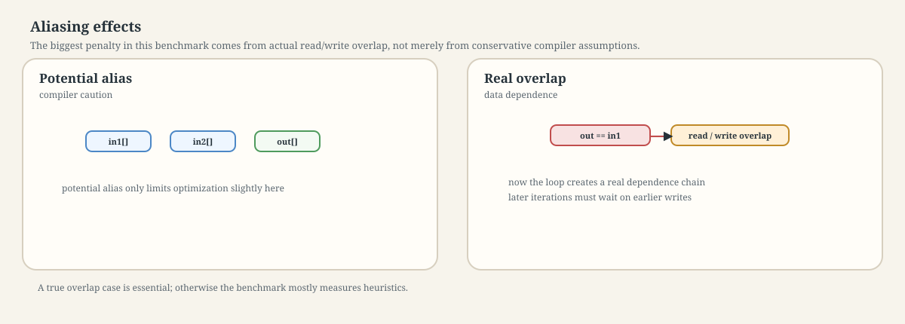

- Diagram note: a real output/input overlap creates the largest dependence chain in this benchmark.

- Key numbers:
  - potential alias: `10.11G items/s`
  - `restrict`-style no-alias: `10.27G items/s`
  - output aliases input: `3.45G items/s`
- Observation: the no-alias signature is only slightly ahead here, but the true aliasing case where output overlaps input is much slower.
- Conclusion: the biggest aliasing penalty in this benchmark comes from overlapping read/write streams, not from the mere possibility of aliasing in the function signature.
- Key takeaway: aliasing benchmarks should include an actual overlap case; otherwise the result may say more about compiler heuristics than data dependence.

## `benchmark/containers/`

### [Container Lookup](benchmark/containers/bm_container_lookup.cpp)

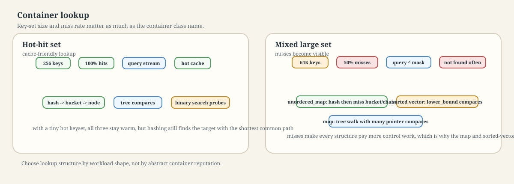

- Diagram note: lookup performance depends on keyset size and miss rate, not just the container type name.

- Key numbers:
  - small hot set: `map 123M`, `unordered_map 1.22G`, sorted vector `59.8M items/s`
  - large mixed set with 50% misses: `map 15.5M`, `unordered_map 448M`, sorted vector `17.1M items/s`
- Observation: `unordered_map` wins in both regimes here, but the gap narrows between `map` and sorted-vector lookup in the larger mixed hit/miss case.
- Conclusion: lookup behavior depends materially on keyset size and miss rate, not just the container class name.
- Key takeaway: always test both hot-hit and larger mixed workloads before choosing a lookup container.

### [`vector` vs `deque` vs `list`](benchmark/containers/bm_vector_deque_list.cpp)

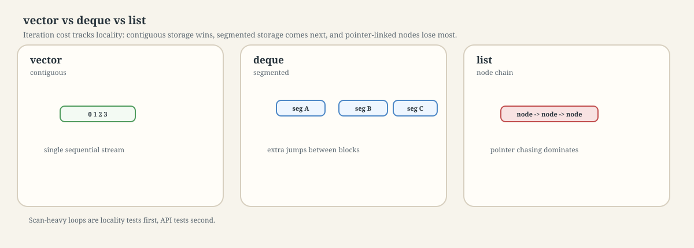

- Diagram note: contiguous iteration wins because it minimizes pointer chasing and cache misses.

- Key numbers:
  - `vector`: `12.7G items/s`
  - `deque`: `3.23G items/s`
  - `list`: `934M items/s`
- Observation: contiguous iteration dominates segmented and pointer-linked iteration in this scan-heavy workload.
- Conclusion: sequence-container iteration cost is primarily a locality story, not an API story.
- Key takeaway: for scan-heavy hot paths, `vector` is the default baseline and other sequence containers need a concrete reason to justify their overhead.

## `benchmark/language/`

### [Dispatch Cost](benchmark/language/bm_virtual_vs_template_dispatch.cpp)

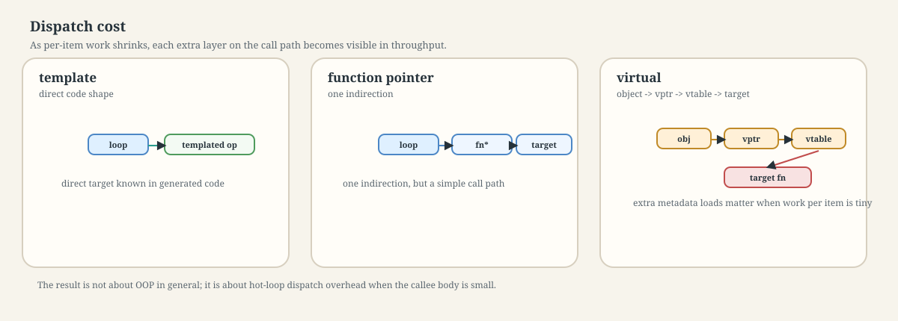

- Diagram note: virtual dispatch adds metadata loads and an extra indirect step relative to templates or function pointers.

- Key numbers:
  - template dispatch: `3.10G items/s`
  - function pointer: `2.95G items/s`
  - virtual dispatch: `1.14G items/s`
- Observation: template and function-pointer dispatch are close, while virtual dispatch is about 2.7x slower in this tight loop.
- Conclusion: when the compiler can keep the call path simple, compile-time or direct-call forms preserve much higher throughput than virtual dispatch.
- Key takeaway: polymorphism choice can materially affect hot-loop throughput, especially when the per-item work is small.

### [Callable Abstraction](benchmark/language/bm_std_function_vs_lambda.cpp)

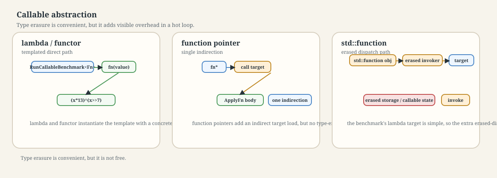

- Diagram note: lightweight callable forms stay close to direct calls, while std::function adds type-erasure overhead.

- Key numbers:
  - lambda: `3.57G items/s`
  - functor: `3.60G items/s`
  - function pointer: `3.63G items/s`
  - `std::function`: `1.23G items/s`
- Observation: erased callable dispatch through `std::function` is roughly 3x slower than the other forms measured here.
- Conclusion: lightweight callable abstractions remain near direct-call speed, while type erasure introduces a visible hot-path cost.
- Key takeaway: `std::function` is convenient, but it should not be the default in throughput-critical inner loops.

### [Exception vs Error Code](benchmark/language/bm_exception_vs_error_code.cpp)

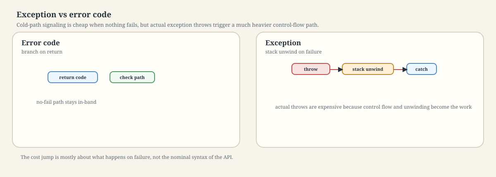

- Diagram note: exception throws are expensive because they change control flow and unwind state, not just because of syntax.

- Key numbers:
  - error-code no-fail: `3.50G items/s`
  - exception no-fail: `2.66G items/s`
  - error-code rare-fail: `2.46G items/s`
  - exception rare-fail: `398M items/s`
- Observation: the no-throw exception path is somewhat slower than optional-style signaling, and actual throws are dramatically slower even at low failure frequency.
- Conclusion: exception handling changes the cost model sharply once failures occur.
- Key takeaway: exceptions can be acceptable on cold paths, but they are expensive for frequently evaluated or moderately hot error paths.

### [`variant` vs Virtual Hierarchy](benchmark/language/bm_variant_vs_virtual.cpp)

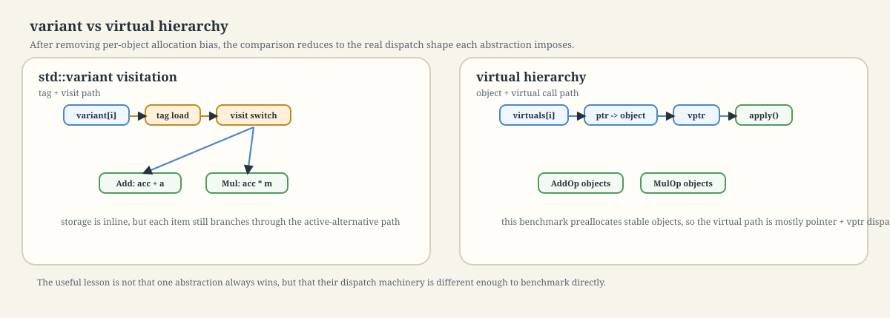

- Diagram note: after equalizing allocation bias, the comparison reduces to dispatch machinery itself.

- Key numbers:
  - `std::variant` dispatch: `553M items/s`
  - virtual hierarchy: `656M items/s`
- Observation: after removing per-object heap-allocation bias and dispatching through stable preallocated objects, the virtual hierarchy is still faster in this mixed-operation benchmark.
- Conclusion: the earlier result was not just an allocation artifact; for this code shape, `std::variant` visitation still loses to virtual dispatch.
- Key takeaway: compare real dispatch patterns directly instead of assuming sum types are always cheaper.

### [`dynamic_cast` vs Tag Dispatch](benchmark/language/bm_dynamic_cast_vs_tag.cpp)

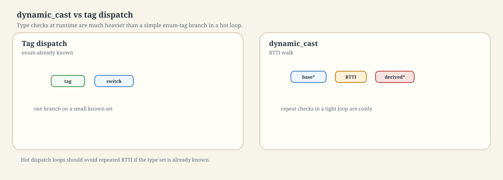

- Diagram note: RTTI dispatch pays for runtime type checks, while tag dispatch is a lighter branch on a known enum.

- Key numbers:
  - enum-tag dispatch: `988.6M items/s`
  - `dynamic_cast` dispatch: `68.0M items/s`
- Observation: RTTI-based type dispatch is roughly an order of magnitude slower than the equivalent tag-based dispatch in this benchmark.
- Conclusion: repeated runtime type checks can dominate hot-path cost when the work per element is small.
- Key takeaway: `dynamic_cast` is fine for cold or structural code paths, but it is a poor default for tight dispatch loops.

## `benchmark/object_model/`

### [NRVO and Return-Value Optimization](benchmark/object_model/bm_nrvo.cpp)

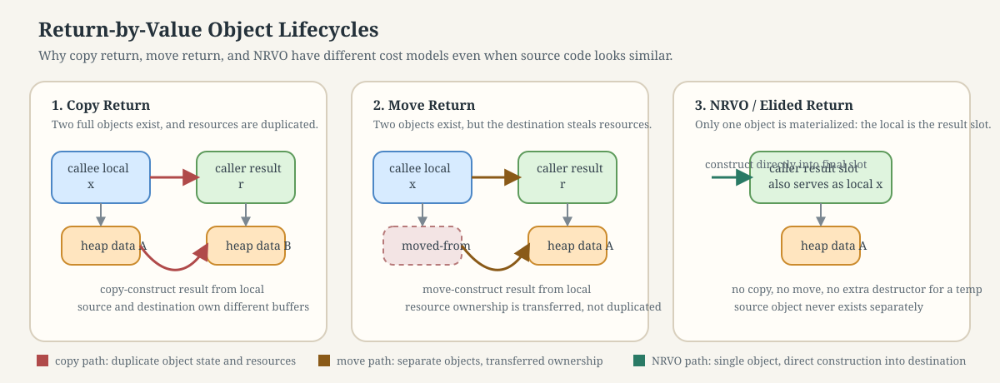

- Diagram note: prvalue return and NRVO eliminate extra object materialization, while explicit move can block that optimization.

- Key numbers:
  - prvalue return: `35.2M items/s`, `copies/op=0`, `moves/op=0`
  - named local with NRVO: `38.4M items/s`, `copies/op=0`, `moves/op=0`
  - named local with explicit `std::move`: `35.6M items/s`, `copies/op=0`, `moves/op=1`
  - two named locals with branch return: `17.8M items/s`, `copies/op=0`, `moves/op=1`
- Observation: direct prvalue return and the simple named-local return both complete with zero copies and zero moves on this AppleClang `-O3` run, while explicit `std::move` and multi-candidate local return both fall back to one move per call.
- Conclusion: the results validate two distinct models: prvalue return benefits from guaranteed copy elision, and a single named local in a simple return path is successfully optimized by NRVO on this compiler. They also show that `return std::move(local);` can disable that optimization and that more complex control flow with multiple return candidates typically degrades to move-return semantics.
- Key takeaway: for return-by-value code, prefer `return local;` over `return std::move(local);` when the source is a local object, and treat multi-object return paths as a different cost shape because they may lose NRVO and add extra construction work.

### [`vptr` / `vtbl` Object Model](benchmark/object_model/bm_vptr_vtbl.cpp)

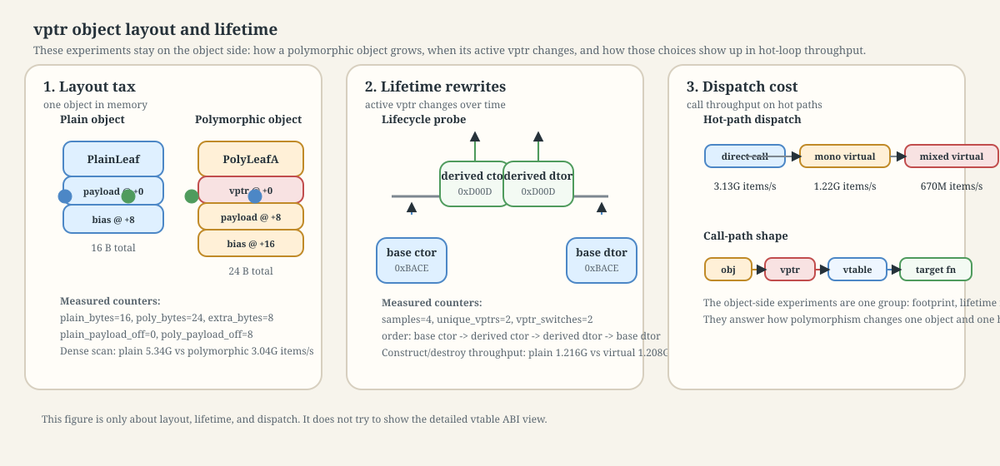

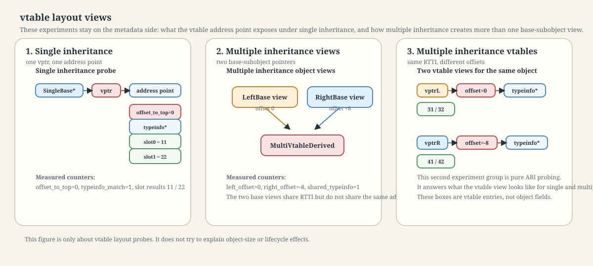

- Diagram note: this benchmark actually contains two experiment groups. The first figure is about object-side effects: layout footprint, lifecycle-specific `vptr` rewrites, and dispatch throughput. The second figure is about metadata-side effects: what the vtable address point exposes under single inheritance and multiple inheritance.

- Key numbers:
  - layout footprint:
    plain object `16 B`, polymorphic object `24 B`
    payload offset shifts from `+0` to `+8`
    dense scan throughput: plain `5.34G` vs polymorphic `3.04G items/s`
  - lifecycle transitions:
    `samples=4`, `unique_vptrs=2`, `vptr_switches=2`
    base ctor tag `0xBACE`, derived ctor tag `0xD00D`
    derived dtor tag `0xD00D`, base dtor tag `0xBACE`
  - vtable layout probes:
    single inheritance: `offset_to_top=0`, `typeinfo_match=1`, slot results `11 / 22`
    multiple inheritance: `left_offset=0`, `right_offset=-8`, `shared_typeinfo=1`, left slots `31 / 32`, right slots `41 / 42`
  - dispatch throughput:
    direct call `3.13G items/s`
    monomorphic virtual call `1.22G items/s`
    polymorphic virtual call `670M items/s`
  - construct/destroy loop:
    plain `1.216G` vs virtual `1.208G items/s`

- Observation: on this AppleClang / Apple Silicon run, making the object polymorphic adds one pointer-sized header and pushes the first payload field back by 8 bytes. That larger footprint alone reduces dense-array scan throughput substantially. The lifecycle probe also confirms that the object does not keep one fixed `vptr` value from birth to death: the active `vptr` switches from base to derived during construction and switches back during destruction.
- Conclusion: the benchmark exposes three distinct parts of the C++ object model. First, `vptr` storage is a layout tax that affects cache density. Second, virtual dispatch semantics during construction and destruction follow the currently live subobject, not the final most-derived type. Third, the vtable view is richer than "just a function pointer array": under the local ABI it includes an `offset-to-top` entry and RTTI pointer, and multiple inheritance creates multiple base-subobject views with different address points and offsets. The hot-loop throughput numbers then show how those metadata layers translate into real call cost, with monomorphic virtual dispatch already much slower than direct calls and mixed-type virtual dispatch slower again.
- Key takeaway: the cost of virtual dispatch is not only an extra indirect branch. It starts with a larger object and more fragmented layout, continues through lifecycle-specific `vptr` rewrites, and ends with extra metadata traffic on the call path. For hot paths, treat polymorphism as a full object-model tradeoff rather than a single dispatch instruction choice.

### [Virtual Base Class ABI and Access Cost](benchmark/object_model/bm_virtual_base_class.cpp)

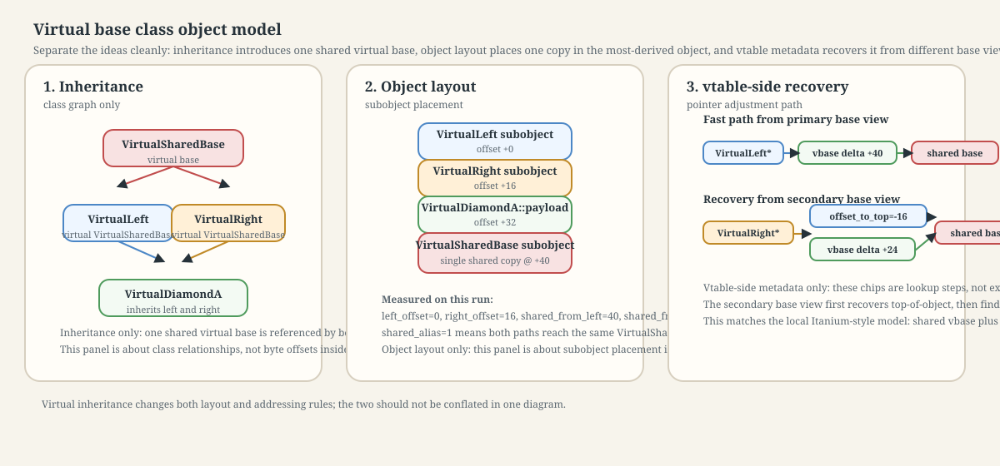

- Diagram note: virtual inheritance changes both layout and addressing rules. The virtual base exists once in the most-derived object, and base-subobject views need ABI metadata to find it.

- Key numbers:
  - aggregate ABI probe:
    direct object `32 B`
    non-virtual diamond `40 B`
    virtual diamond A `48 B`
    virtual diamond B `72 B`
    `left_offset=0`, `right_offset=16`, shared virtual base at `+40`
    `shared_from_left=40`, `shared_from_right=24`, `shared_alias=1`
    `left_offset_to_top=0`, `right_offset_to_top=-16`, `shared_typeinfo=1`
  - aggregate access throughput:
    direct pointers `893.8M items/s`
    non-virtual base pointers `836.1M items/s`
    virtual complete-object access `773.7M items/s`
    virtual-base access via monomorphic base pointers `763.6M items/s`
    virtual-base access via mixed derived types `705.3M items/s`

- Observation: on this 2026-05-08 AppleClang 15 / macOS arm64 run, `VirtualDiamondA` is laid out as primary `VirtualLeft` at offset `0`, secondary `VirtualRight` at `+16`, payload at `+32`, and one shared `VirtualSharedBase` at `+40`. The runtime probe shows both inheritance paths alias the same shared base (`shared_alias=1`), while the secondary base view reports `offset_to_top=-16`, matching the object-model pattern already seen in the multiple-inheritance vtable probe.
- Conclusion: the local ABI is consistent with the mainstream Clang/GCC Itanium-style model rather than the MSVC `vbptr`/`vbtable` model. Clang record-layout dumps confirm one shared virtual-base subobject in the most-derived object, and the runtime vtable probe confirms that base-subobject views are recovered through vtable-associated metadata and `this` adjustment. In other words, the ABI model here is "shared virtual base plus vtable-driven offset recovery," not "extra standalone virtual-base pointer field."
- Key takeaway: virtual inheritance has a measurable but not catastrophic cost in this workload. The object grows from `40 B` to `48 B`, and hot-path reads through a virtual base are roughly `9%` slower than the comparable non-virtual base case here (`763.6M` vs `836.1M items/s`), with a further drop when the base pointer stream becomes polymorphic (`705.3M items/s`). The main cost is not one special instruction; it is a combination of larger layout, extra address adjustment, and reduced optimizer freedom around the base access path.

## `benchmark/syscalls/`

### [`mmap` vs `read` / `pread`](benchmark/syscalls/bm_mmap_vs_read.cpp)

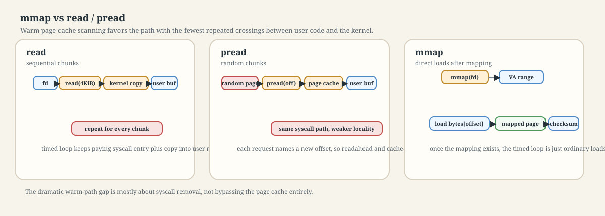

- Diagram note: mmap removes the per-chunk syscall path, while read and pread keep crossing the kernel boundary.

- Key numbers:
  - sequential `read`: `6.70 GiB/s`
  - random `pread`: `5.51 GiB/s`
  - sequential `mmap`: `676.4 GiB/s`
- Observation: mapped-file scanning is dramatically faster than syscall-based reads on the warm-cache path measured here.
- Conclusion: once mapping is established, direct memory access removes per-chunk syscall overhead; random `pread` remains slower because access locality is weaker.
- Key takeaway: `mmap` is a strong baseline for repeated warm reads, but interpretation must account for page-cache state and first-touch fault cost.

### [Clock Call Overhead](benchmark/syscalls/bm_clock_overhead.cpp)

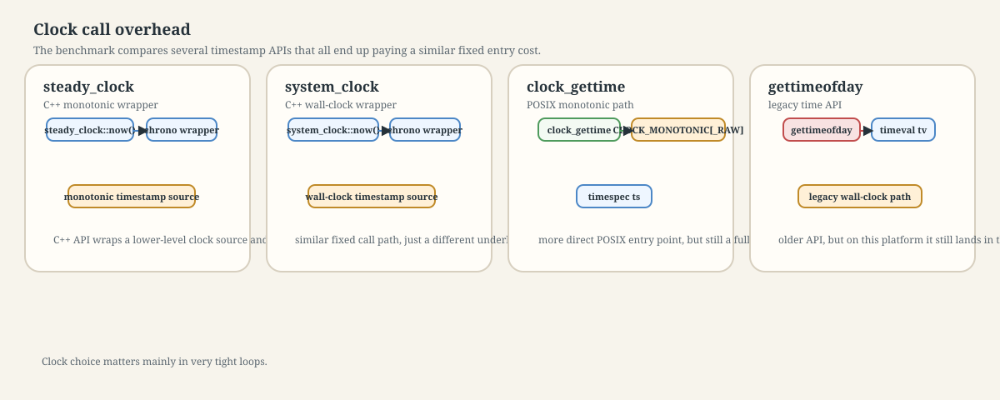

- Diagram note: all clock APIs live in the same rough cost band, so the choice matters mostly in very tight loops.

- Key numbers:
  - `steady_clock::now()`: `70.1M calls/s`
  - `system_clock::now()`: `65.6M calls/s`
  - `clock_gettime`: `73.9M calls/s`
  - `gettimeofday`: `98.2M calls/s`
- Observation: all four timing APIs are in the same rough cost band, with `gettimeofday` fastest in this run.
- Conclusion: time-source selection still matters in very tight loops, but the gap is tens of millions of calls per second rather than orders of magnitude.
- Key takeaway: timestamping is not free; measure the exact clock path used by a latency-sensitive loop.

### [`mmap` Private vs Shared Writes](benchmark/syscalls/bm_mmap_cow.cpp)

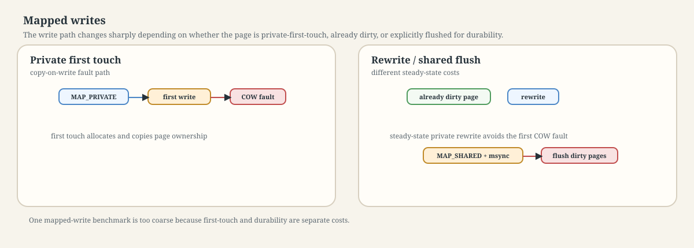

- Diagram note: first-touch COW, rewrite, and shared flush are different costs that a single mapped-write number would blur together.

- Key numbers:
  - private first-touch write: `7.27 GiB/s`
  - private rewrite on already-dirtied pages: `48.5 GiB/s`
  - shared write without `msync`: `26.2 GiB/s`
  - shared write with `msync`: `11.9 GiB/s`
- Observation: first-touch private writes are far slower than rewriting already-private pages, and forcing `msync` cuts shared-write throughput sharply.
- Conclusion: copy-on-write fault cost, dirty-page state, and flush policy all matter enough that a single mapped-write benchmark is too coarse.
- Key takeaway: mapped-write benchmarks should separate first-touch, steady-state rewrite, and explicit durability cost.

### [Page Fault and `mlock`](benchmark/syscalls/bm_page_fault_mlock.cpp)

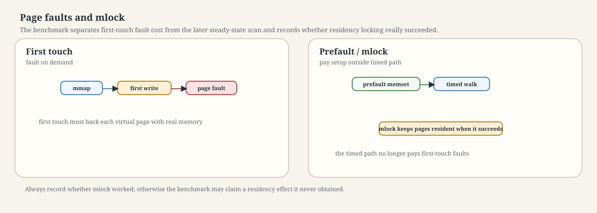

- Diagram note: first-touch, prefault, and mlock separate fault cost from steady-state access cost.

- Key numbers:
  - first-touch mapped access: `15.2 GiB/s`
  - prefaulted mapped access: `33.0 GiB/s`
  - `mlock` path: `129.9 GiB/s`, `mlock_ok=1`
- Observation: prefaulting still removes a large part of the first-touch cost, and this rerun successfully obtained locked memory on the current machine.
- Conclusion: page-fault cost is substantial enough to dominate the first pass over a region, and memory locking meaningfully changes the residency story when it actually succeeds.
- Key takeaway: separate first-touch, prefaulted, and locked-memory cases, and always record whether locking actually worked.

## `benchmark/ipc/`

### [Pipe vs Shared-Memory Handoff](benchmark/ipc/bm_pipe_vs_shm.cpp)

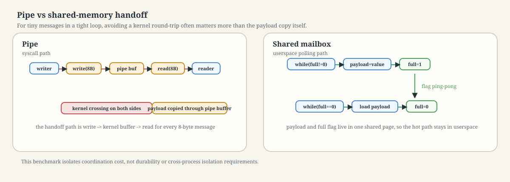

- Diagram note: the mailbox path avoids the kernel round-trip that the pipe must pay on each handoff.

- Key numbers:
  - pipe handoff: `2.31M msgs/s`
  - shared-memory mailbox: `10.6M msgs/s`
- Observation: the shared-memory mailbox is about 4.6x faster than the pipe path in this thread-to-thread handoff test.
- Conclusion: syscall-heavy message transfer pays a large fixed cost relative to a lock-free shared-memory handoff.
- Key takeaway: for small messages and tight loops, avoiding kernel crossings can materially improve throughput.

### [Pipe vs `socketpair`](benchmark/ipc/bm_socketpair_vs_pipe.cpp)

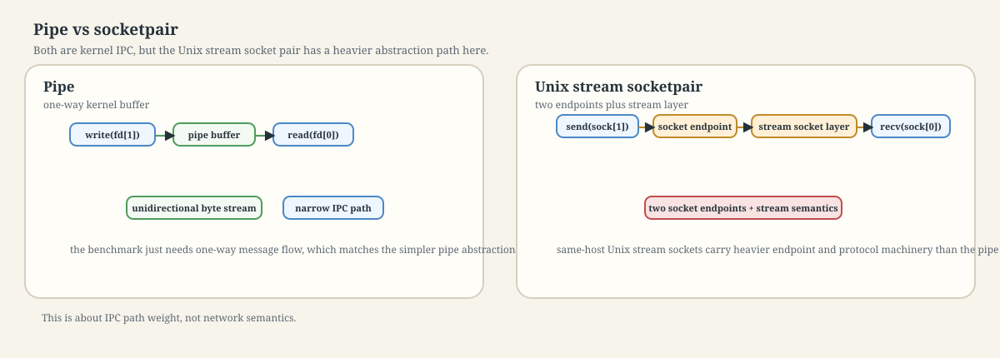

- Diagram note: the stream socket pair pays a heavier IPC path than the pipe in this benchmark.

- Key numbers:
  - pipe: `2.43M msgs/s`
  - Unix stream `socketpair`: `1.42M msgs/s`
- Observation: the pipe path is still clearly faster than the Unix-domain stream socket pair after tightening the benchmark to the reliable stream case.
- Conclusion: even same-host kernel communication paths have a measurable abstraction ladder.
- Key takeaway: prefer the narrowest IPC primitive that matches the dataflow and semantics you need.

## `benchmark/network/`

### [TCP Loopback](benchmark/network/bm_socket_loopback.cpp)

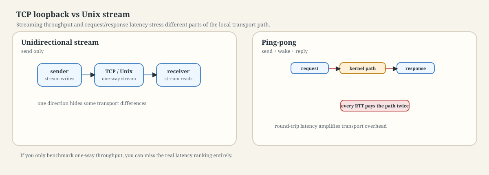

- Diagram note: stream throughput and ping-pong latency stress different parts of the local transport path.

- Key numbers:
  - unidirectional stream:
    TCP `1.57M msgs/s`
    Unix stream `1.54M msgs/s`
  - request/response ping-pong:
    TCP `45.5k round trips/s`
    Unix stream `209.6k round trips/s`
- Observation: the transport choice barely matters in the one-way stream test, but matters a great deal in the request/response latency shape.
- Conclusion: throughput and round-trip latency can rank the same transports very differently.
- Key takeaway: network-path benchmarks should include both streaming and ping-pong shapes, not just one direction of traffic.

## Final Takeaways

- Cache/locality: stride, pointer chasing, and associativity all show that access pattern sets the upper bound.
- Latency vs throughput: regular sequential access is throughput-friendly; random/conflicting access is latency-dominated.
- Contention/synchronization: false sharing, mutex/atomic, and queue tests all expose shared-write hotspots.
- Data layout: AoS vs SoA should be decided by field utilization and vectorization opportunities.
- Allocation strategy: memory pools need thread-aware design, otherwise synchronization overhead can erase gains.
- Syscall boundary: `mmap` warm-path scans and shared-memory handoff both outperform syscall-heavy alternatives in these runs.
- Language overhead: virtual dispatch and `std::function` both show clear hot-path cost relative to simpler call forms.
- Coordination strategy: spinning is far faster than blocking in the hottest handoff loop, but that result comes with obvious CPU-usage tradeoffs.
- Error signaling: rare thrown exceptions are already expensive enough to materially reshape throughput.
- IPC and transport: shared memory, pipes, Unix-domain sockets, and TCP loopback form a visible cost ladder on the same machine.
- Data structures and allocators: `unordered_map` wins this lookup workload, while globally synchronized pools lose badly in cross-thread ownership transfer.
- Memory residency and container layout: first-touch page cost and non-contiguous container traversal both show how strongly locality and residency shape throughput.
- Allocator and RTTI choice: allocator lifetime model and runtime type-check strategy can both dominate throughput once they enter a hot loop.
- Allocator variance: the same allocator family can look excellent or terrible depending on size mix and recycling policy.
- Queue measurements: synchronization choice, payload size, and topology all materially change which queue design wins.
- Lock behavior: lock rankings shift when the amount of work inside the critical section changes, so contention studies need more than one lock-scope size.
- Measurement discipline: placement and aliasing results both demonstrate that platform behavior must be validated before turning a benchmark into a general claim.
- Platform caveats: affinity and scheduling experiments need explicit validation because API support and enforcement vary by OS.
- Return-by-value model: prvalue return and simple named-local return can both be zero-overhead on modern compilers, but explicit `std::move` on a local return value may pessimize the path by preventing NRVO.
- Object model cost: `vptr`/`vtbl` overhead shows up in three layers at once: larger object footprint, lifecycle-dependent dynamic type transitions, and a more expensive metadata-driven dispatch path.
